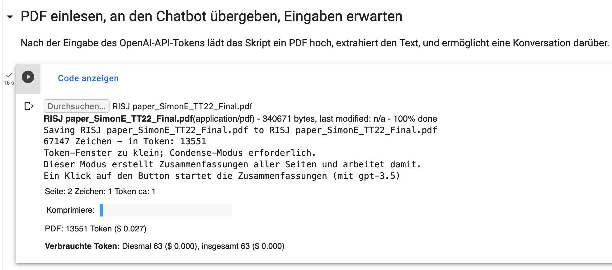

# TalkToPDF
GPT-3.5 bzw. GPT-4 liest für Dich (PDF)-Texte und beantwortet deine Fragen zum Text. 

## Was man braucht
- Ein Google-Konto (um das Notebook in Colab auszuführen); ersatzweise eine lokale juPyter-Installation
- Ein gültiges Token für die OpenAI-API
- Ein nicht zu langes PDF, das Text enthält (wenn das PDF nur Fotos des Textes enthält, wird der Text nicht verarbeitet)

## Wie man es nutzt
- Das [Notebook](./TalkToPDF.ipynb) anklicken und den "Open in Colab"-Button anklicken. (Also: in Googles Colab öffnen)
- Das kleine "Play"-Dreieck bei der ersten Code-Zelle anklicken - die Vorbereitungen werden ausgeführt
- Das kleine "Play"-Dreieck bei der nächsten Code-Zelle anklicken - und ein gültiges OpenAI-API-Token eingeben. 
- Das kleine "Play"-Dreieck bei der nächsten Code-Zeile anklicken, ein PDF hochladen.
- Ggf. Modell (und damit Token-Grenze) anpassen und ggf. den Text kondensieren lassen. 
- Mit dem Modell über das PDF chatten. 

## Grenzen
Text, Fragen und Antworten müssen in die Token-Grenze passen - das setzt für GPT3.5 (max. 4096 Token) die Grenze bei 3-5 Seiten. (Und dann sind nur noch sehr kurze Fragen und Antworten möglich.) Kondensieren ermöglicht Texte mit bis zu 8-facher Länge. 

## Zukünftig Vektor-Datenbank?

Der richtige Weg wäre vielleicht eine "Vektor-Datenbank": Jeden Abschnitt/Absatz in ein Embedding umsetzen lassen - gewissermaßen einen Fingerabdruck der Bedeutungen des Texts - und dann nach passenden Embeddings suchen, diese auslesen und das Modell darüber reden lassen. Dadurch könnte sehr viel Text durchsucht werden - wie man es schafft, dass das Modell gezielt in den Volltext hereinliest, um antworten zu können, muss aber erst noch erprobt werden. 
